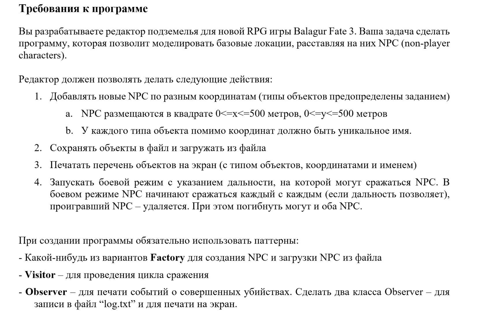

## Лабораторная работа №6. Дисциплина: ООП 

# Рыбин Владимир Викторович

## Вариант: 13

## Задание:
| **Объекты**              | **Правила совместимости**       |
|--------------------------|---------------------------------|
| **Дракон**               | Дракон убивает рыцарей          |
| **Жаба**                 | Жаба убивает всех (включая жаб) |
| **Странствующий рыцарь** | Рыцарь убивает драконов         |

## Требования

